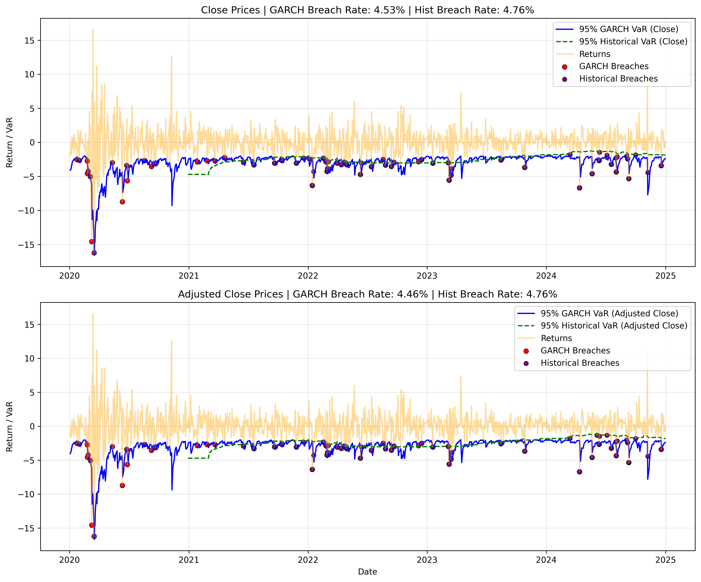

# JPM Volatility Modeling with GARCH and VaR


## Overview

This project analyzes JPMorgan (JPM) stock returns using a **GARCH(1,1)** model to estimate time-varying volatility and compute **parametric and non-parametric 95% one-day Value at Risk (VaR)**.

It demonstrates how volatility clustering affects downside risk and evaluates model calibration through statistical backtesting techniques widely used in quantitative risk management

In addition to the GARCH-based VaR model, the project incorporates a **Historical Simulation VaR** approach, enabling a direct comparison between **parametric (model-based)** and **non-parametric (data-driven)** risk estimation methods.

The results highlight how different modeling assumptions influence responsiveness to market volatility and the statistical reliability of downside risk estimates.

---

## Project Objective

The goal of this project is to model **dynamic market risk** in JPMorgan equity returns by capturing time-varying volatility and translating it into measurable risk estimates.

Specifically, the project evaluates and compares **parametric (GARCH-based)** and **non-parametric (Historical Simulation)** Value at Risk (VaR) models to determine whether predicted risk levels are consistent with observed market outcomes.

This comparison provides insight into how different modeling assumptions affect the **accuracy and responsiveness** of risk estimates.

Model performance is assessed through statistical backtesting, including **VaR breach analysis** and the **Kupiec Proportion of Failures test**, to evaluate calibration and reliability.

---

## Why GARCH?

Financial return series exhibit **volatility clustering**, where periods of high volatility tend to persist rather than revert immediately.

Traditional models assume constant variance, which fails to capture this key feature of financial markets. GARCH models address this limitation by allowing volatility to evolve dynamically based on both recent shocks and past volatility.

GARCH models are widely used in:
- Market risk management  
- Derivatives pricing  
- Portfolio risk analysis  

This project applies a **GARCH(1,1)** model due to its strong empirical performance, interpretability, and ability to capture persistent volatility dynamics observed in equity returns.

By modeling time-varying volatility, GARCH provides a more realistic and responsive foundation for estimating **Value at Risk (VaR)**, particularly during periods of market stress when risk levels change rapidly.

---

## GARCH and VaR Explained

### GARCH (Generalized Autoregressive Conditional Heteroskedasticity)

GARCH models estimate **time-varying volatility** in financial returns.

A standard **GARCH(1,1)** model is defined as:

\[
\σ²ₜ = ω + αε²ₜ₋₁ + βσ²ₜ₋₁
\]

- \( \alpha \): sensitivity to new shocks  
- \( \beta \): persistence of volatility  
- High \( \alpha + \beta \) ⇒ volatility clustering  

**Intuition:**  
Volatility is driven by both **recent market shocks** and **past volatility levels**, allowing the model to capture the tendency of financial markets to experience sustained periods of high or low volatility.

---

### Value at Risk (VaR)

Value at Risk estimates the **maximum expected loss over a given time horizon at a specified confidence level**.

In this project:
- A **95% one-day VaR** is used  
- There is a **5% probability that losses exceed this level**

\[
VaRₜ (95%) = −1.65 × σₜ
\]

**What it means:**  
On a given day, there is a 95% probability that losses will not exceed the VaR threshold, and a 5% probability of experiencing a larger loss.

**Why it matters:**  
VaR translates volatility into a **practical risk metric**, allowing us to quantify potential downside exposure in a way that can be evaluated and tested against actual market outcomes.

In this project, VaR is computed using both:
- **GARCH-based volatility estimates (parametric)**  
- **Historical return distributions (non-parametric)**  

This enables a comparison of how different modeling approaches affect risk estimation.

---

### Why Combine GARCH and VaR?

- Volatility becomes **dynamic rather than constant**  
- Risk estimates respond to **changing market conditions**  
- Downside risk is better captured during **periods of market stress**  

By combining GARCH with VaR, the model translates time-varying volatility into a **practical measure of downside risk**, allowing risk levels to adjust as market conditions evolve.

In this project, GARCH-based VaR is evaluated alongside **Historical Simulation VaR**, enabling a comparison between **parametric and non-parametric risk estimation approaches**.

This comparison highlights how different modeling assumptions influence both the **responsiveness** and **stability** of risk estimates.

---

## Methodology

This project follows a structured workflow aligned with standard practices in **quantitative risk modeling and financial time series analysis**:

### 1. Data Collection

Historical price data for JPMorgan (JPM) is retrieved using the `yfinance` API.

**What it does:**  
Provides the raw price series used to compute returns and estimate volatility.

**Why it matters:**  
Accurate and consistent data is critical, as risk estimates are highly sensitive to input quality and data integrity.

---

### 2. Return Calculation

Daily **log returns** are computed:

\[
rₜ = ln(Pₜ / Pₜ₋₁)
\]

**What it does:**  
Transforms price data into a stationary return series suitable for statistical analysis and volatility modeling.

**Why it matters:**  
Log returns are time-additive and more appropriate for financial modeling, particularly in volatility frameworks such as GARCH, where assumptions about return distributions and variance stability are required.
---

### 3. Volatility Modeling (GARCH)

A **GARCH(1,1)** model is used to estimate time-varying volatility:

\[
\σ²ₜ = ω + αε²ₜ₋₁ + βσ²ₜ₋₁
\]

**What it does:**  
Estimates conditional volatility based on both recent return shocks and past volatility, producing a dynamic measure of risk over time.

**Why it matters:**  
GARCH captures **volatility clustering**, allowing risk estimates to adapt to changing market conditions rather than assuming constant variance.

This time-varying volatility serves as the foundation for calculating **Value at Risk (VaR)** in the next step.
---

### 4. Value at Risk (VaR) Estimation

VaR is calculated using conditional volatility:

\[
VaRₜ (95%) = −1.65 × σₜ
\]

**What it does:**  
Transforms the estimated volatility into a threshold representing the maximum expected loss at a 95% confidence level.

**Why it matters:**  
VaR translates volatility into a **quantifiable downside risk measure**, allowing risk estimates to be evaluated against actual market outcomes.

In this project, VaR is computed using both:
- **GARCH-based volatility (parametric)**  
- **Historical return distributions (non-parametric)**  

This enables a direct comparison of how different modeling approaches estimate risk.

---

### 5. Historical Simulation VaR

A **250-day rolling Historical Simulation VaR** is computed using the empirical 5th percentile of past returns.

**What it does:**  
Estimates the VaR threshold directly from the distribution of historical returns, without assuming any specific parametric model.

**Why it matters:**  
This provides a **non-parametric benchmark**, allowing comparison with the model-based GARCH VaR and assessing sensitivity to distributional assumptions.

Because it relies solely on past data, Historical VaR produces a smoother estimate of risk but may respond more slowly to sudden changes in market volatility.

---

### 6. Backtesting (VaR Validation)

A **breach** occurs when actual returns fall below the VaR estimate.

**What it measures:**  
Backtesting evaluates how well the model’s predicted risk aligns with realized market outcomes.

**Why it matters:**  
A correctly specified 95% VaR model should produce breaches approximately **5% of the time**.

- Too many breaches → risk is underestimated  
- Too few breaches → risk is overestimated  

Backtesting provides a direct link between **model predictions and real-world performance**, forming the basis for formal statistical validation in the next step.

---

### 7. Kupiec Proportion of Failures Test

The Kupiec test evaluates whether the observed breach rate matches the expected rate:

\[
LR_uc = −2 ln [ ((1 − p)^(n − x) · p^x) / ((1 − p̂)^(n − x) · p̂^x) ]
\]

**What it measures:**  
Whether the **frequency of VaR breaches** is consistent with the expected probability (5%).

**Why it matters:**  
A model may appear reasonable visually but still systematically over- or under-estimate risk.  
The Kupiec test provides a **formal statistical check of model calibration**.

**How to interpret results:**
- If the test statistic is **below the critical value (3.84)** → the model is well calibrated  
- If it exceeds the critical value → the model is misspecified  

This test serves as the primary criterion for evaluating whether the VaR models produce **statistically reliable risk estimates**.

---

### 8. (Optional Enhancement) Christoffersen Conditional Coverage Test

The Christoffersen test extends the Kupiec test by evaluating:

- **Unconditional coverage** (correct number of breaches)  
- **Independence of breaches** (no clustering beyond randomness)

**What it measures:**  
Whether VaR breaches occur **independently over time**, rather than clustering in predictable patterns.

**Why it matters:**  
A model may pass the Kupiec test by producing the correct number of breaches, but still fail if those breaches occur in clusters.  
Clustering suggests the model does not fully capture changes in underlying market risk.

**Interpretation:**
- A valid model should produce both the correct number of breaches **and** ensure they are not serially dependent  

The Christoffersen test therefore provides a more **comprehensive validation framework**, combining accuracy of breach frequency with the temporal behavior of risk events.

---

### 9. Robustness Check (Close vs Adjusted Close)

The model is evaluated using both **Close** and **Adjusted Close** price series.

**What it does:**  
Tests whether the results are consistent across different definitions of the underlying price data.

**Why it matters:**  
Adjusted Close prices account for dividends and corporate actions, while Close prices do not.  
Comparing both ensures that model results are not driven by data construction choices.

Consistency across both series indicates that the model is **robust and not sensitive to pricing conventions**, strengthening confidence in the reliability of the results.

---

## Key Insights

- Volatility increases sharply during periods of market stress (e.g., 2020), confirming the presence of **volatility clustering** in financial returns  
- **GARCH-based VaR responds quickly** to changes in market conditions, capturing rapid increases in risk during volatile periods  
- **Historical Simulation VaR is smoother** and less reactive, reflecting its reliance on a rolling window of past returns  
- Both models produce breach rates close to the expected 5%, indicating that they are **well calibrated and statistically reliable**  
- VaR breaches tend to occur during periods of extreme market stress, highlighting the challenge of modeling **tail risk and rare events**  

Overall, the results demonstrate that while both models provide reliable risk estimates, they differ in how quickly they adapt to changing market conditions, reflecting a trade-off between **responsiveness and stability** in risk modeling.

---

## Model Validation

The models were evaluated using VaR backtesting and the **Kupiec Proportion of Failures test**, which assesses whether observed breach frequencies align with theoretical expectations.

This validation framework combines **empirical backtesting** with **formal statistical testing** to determine whether the models produce **statistically consistent risk estimates** relative to the expected 5% breach rate.

These results provide the foundation for assessing model reliability and interpreting performance in the analysis that follows.

### GARCH VaR Results

- Observed breach rate (Close): **4.53%**  
- Observed breach rate (Adjusted Close): **4.46%**  
- Expected breach rate: **5.00%**  

- Kupiec LR (Close): **0.59**  
- Kupiec LR (Adjusted Close): **0.81**  
- Critical value (95%, df=1): **3.84**

**Interpretation:**  
The observed breach rates are close to the expected 5%, and the Kupiec statistics fall well below the critical value.

This indicates that the GARCH VaR model is **well calibrated**, meaning it neither systematically underestimates nor overestimates risk.  
The results confirm that the model produces **statistically reliable and consistent risk estimates** across both price definitions.

---

### Historical Simulation VaR Results

- Observed breach rate (Close): **4.76%**  
- Observed breach rate (Adjusted Close): **4.76%**  
- Expected breach rate: **5.00%**

**Interpretation:**  
The Historical Simulation VaR produces breach rates close to the expected 5%, indicating that it is also **well calibrated** despite not relying on a parametric model.

This suggests that a purely data-driven approach can generate **statistically consistent risk estimates**, even without explicitly modeling volatility dynamics.

However, unlike GARCH, Historical VaR relies on past observations and may respond more slowly to sudden changes in market conditions.

---

### Overall Interpretation

- Both models pass the Kupiec test, indicating that **predicted risk levels are statistically consistent with observed outcomes**  
- The similarity in breach rates suggests that both parametric (GARCH) and non-parametric (Historical) approaches can produce **reliable VaR estimates**  
- However, differences in model structure affect responsiveness:
  - **GARCH adapts quickly** to changes in market volatility  
  - **Historical VaR adjusts more slowly**, as it relies on a rolling window of past returns  

These results demonstrate that while both approaches achieve similar levels of calibration, they differ in how effectively they capture **changing market conditions**.

This highlights a key trade-off in risk modeling between **responsiveness (GARCH)** and **stability (Historical Simulation)**.

---

## Close vs Adjusted Close Comparison

To assess model robustness, the analysis was performed using both **Close** and **Adjusted Close** price series across both VaR methodologies.

### GARCH VaR

- Close breach rate: **4.53%** (Kupiec: 0.59)  
- Adjusted Close breach rate: **4.46%** (Kupiec: 0.81)

### Historical Simulation VaR

- Close breach rate: **4.76%**  
- Adjusted Close breach rate: **4.76%**

Both models pass the Kupiec test and produce highly consistent results across price definitions.

**Interpretation:**

- Dividend adjustments have minimal impact on short-term return dynamics for JPM over the sample period  
- Adjusted Close prices provide a more economically accurate measure of returns and are therefore theoretically preferred  
- The consistency in results across both GARCH and Historical VaR indicates that the model is **robust to the choice of price definition**  

Overall, the findings suggest that model performance is driven by underlying return dynamics rather than data construction choices, reinforcing confidence in the reliability of the results.

---

## Results

### GARCH vs Historical VaR Comparison

The chart below compares:
- GARCH-based VaR (parametric)
- Historical Simulation VaR (non-parametric)
- Actual returns
- VaR breach points for both models  



---

### Interpretation

- Both models produce breach rates close to the expected 5%, indicating **strong statistical calibration**  
- **GARCH VaR responds more quickly** to volatility spikes, particularly during periods of market stress (e.g., the 2020 COVID shock)  
- **Historical Simulation VaR is smoother** but adjusts more slowly due to its reliance on a rolling window of past returns  
- VaR breaches for both models tend to cluster during extreme market events, reflecting the inherent difficulty of modeling **tail risk**  

This comparison highlights a fundamental trade-off in risk modeling between:
- **Responsiveness (GARCH)** — faster adaptation to changing volatility  
- **Stability (Historical Simulation)** — smoother, more stable risk estimates  

Overall, while both approaches are well calibrated, their differences in responsiveness illustrate how model choice affects the **timing and sensitivity of risk estimation**.

---

### Additional Visualizations (Optional)

#### GARCH Volatility and VaR Backtest


#### Close vs Adjusted Close Comparison


---

## Project Structure

```
jpm-volatility-garch-var/
│
├── garch_var_model.py      # Main modeling and analysis script
├── requirements.txt        # Project dependencies
├── README.md               # Project documentation
└── images/
    ├── garch_vs_historical_var.png   # GARCH vs Historical VaR comparison
    ├── garch_var_backtest.png        # GARCH volatility and VaR backtest
    └── garch_var_close_vs_adj.png    # Close vs Adjusted Close comparison
```

---

## Tools & Libraries

- Python  
- pandas, numpy  
- matplotlib  
- yfinance  
- arch  

---

## How to Run

Clone the repository and install dependencies:

```bash
git clone https://github.com/jasonrkeen/jpm-volatility-garch-var.git
cd jpm-volatility-garch-var
pip install -r requirements.txt
```

Run the model:

```bash
python garch_var_model.py
```

---

## Future Improvements

- Implement rolling-window VaR for out-of-sample forecasting  
- Apply the Christoffersen conditional coverage test for independence of breaches  
- Extend the model to portfolio-level risk analysis  
- Incorporate alternative distributions (e.g., Student-t) for improved tail risk modeling  

---

## Author

Jason Keen