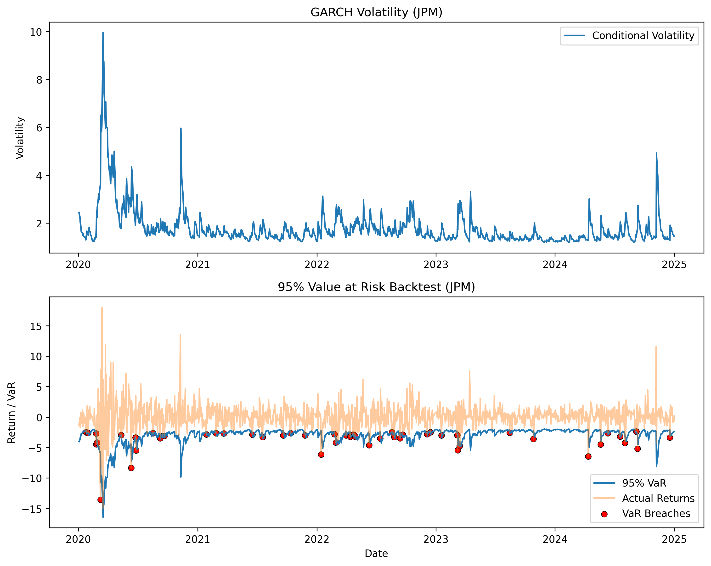

# JPM Volatility Modeling with GARCH and VaR


## Overview

This project analyzes JPMorgan (JPM) stock returns using a **GARCH(1,1)** model to estimate time-varying volatility and compute a **95% one-day Value at Risk (VaR)**.

It demonstrates how volatility clustering affects downside risk and evaluates model calibration through statistical backtesting techniques.

---

## Project Objective

The goal is to model **dynamic market risk** in equity returns and evaluate whether a volatility-based VaR model is properly calibrated.

---

## Why GARCH?

Financial return series exhibit **volatility clustering**, where periods of high volatility are followed by high volatility and vice versa.

GARCH models capture this time-varying variance and are widely used in:
- Market risk management  
- Derivatives pricing  
- Portfolio risk analysis  

This project applies a **GARCH(1,1)** model due to its strong empirical performance and interpretability.

---

## GARCH and VaR Explained

### GARCH (Generalized Autoregressive Conditional Heteroskedasticity)

GARCH models estimate **time-varying volatility** in financial returns.

A standard **GARCH(1,1)** model is defined as:

\[
\sigma_t^2 = \omega + \alpha \epsilon_{t-1}^2 + \beta \sigma_{t-1}^2
\]

where:
- \( \sigma_t^2 \) = current variance  
- \( \omega \) = long-run variance  
- \( \epsilon_{t-1}^2 \) = previous shock  
- \( \sigma_{t-1}^2 \) = previous variance  

### Intuition

- \( \alpha \): sensitivity to new shocks  
- \( \beta \): persistence of volatility  
- High \( \alpha + \beta \) ⇒ volatility clustering  

---

### Value at Risk (VaR)

Value at Risk estimates the **maximum expected loss over a given time horizon at a specified confidence level**.

In this project:
- A **95% one-day VaR** is used  
- There is a **5% probability that losses exceed this level**

\[
VaR_{t}^{95\%} = -1.65 \cdot \sigma_t
\]

---

### Why Combine GARCH and VaR?

- Volatility becomes **dynamic**
- Risk responds to **market conditions**
- Downside risk is better captured during **stress periods**

---

## Methodology

### Data
- Historical data retrieved using `yfinance`
- Daily **log returns** computed

### Modeling
- GARCH(1,1) fitted using `arch`
- Conditional volatility estimated
- VaR derived from volatility

### Backtesting
- VaR breaches identified (actual return < VaR)
- Kupiec test used for statistical validation

---

## Key Insights

- Volatility spikes during stress periods (e.g., 2020)
- Volatility clustering is clearly visible
- VaR expands during high-risk regimes

---

## Model Validation

- Observed VaR breach rate: **4.14%**  
- Expected breach rate: **5.00%**  
- Kupiec LR statistic: **2.09**  
- Critical value (95%, df=1): **3.84**  

**Result:** Fail to reject → model is **well-calibrated**

---

## Close vs Adjusted Close Comparison

To test robustness, the model was run using both **Close** and **Adjusted Close** prices.

- Close breach rate: **4.53%** (Kupiec: 0.59)  
- Adjusted Close breach rate: **4.46%** (Kupiec: 0.81)  

Both models pass validation and produce highly similar results.

👉 Interpretation:
- Dividend adjustments have minimal short-term impact for JPM  
- Adjusted Close is **theoretically preferred** for return modeling  

---

## Results

The chart below shows:
- GARCH volatility
- VaR threshold
- Actual returns
- Breach points



### Interpretation

- High volatility → wider VaR bands  
- Breaches cluster during stress periods  
- Observed frequency aligns with expected 5%  

---

## Project Structure

```
jpm-volatility-garch-var/
│
├── garch_var_model.py
├── requirements.txt
├── README.md
└── images/
    └── var_backtest.png
```

---

## Tools & Libraries

- Python  
- pandas  
- numpy  
- matplotlib  
- yfinance  
- arch  

---

## How to Run

```bash
git clone https://github.com/jasonrkeen/jpm-volatility-garch-var.git
cd jpm-volatility-garch-var
pip install -r requirements.txt
python garch_var_model.py
```

---

## Future Improvements

- Rolling-window VaR (out-of-sample forecasting)
- Historical VaR comparison
- Christoffersen test
- Portfolio VaR

---

## Author

Jason Keen