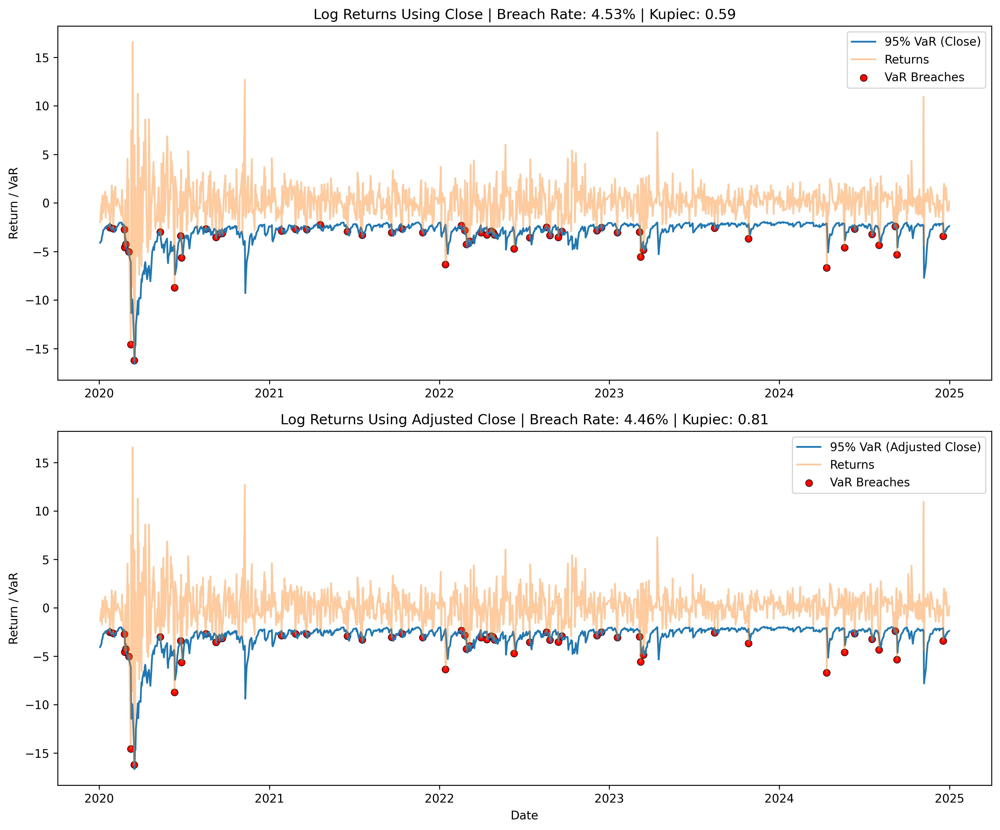

# JPM Volatility Modeling with GARCH and VaR


## Overview

This project analyzes JPMorgan (JPM) stock returns using a **GARCH(1,1)** model to estimate time-varying volatility and compute a **95% one-day Value at Risk (VaR)**.

It demonstrates how volatility clustering affects downside risk and evaluates model calibration through statistical backtesting techniques commonly used in risk management.

While studying financial ethics and regulation, I became interested in JPMorgan’s role in the evolution of modern financial markets—particularly its involvement in the growth of derivatives trading. The 2007–2008 financial crisis highlighted the risks associated with complex financial instruments and reinforced the importance of robust risk management frameworks.

This project reflects that interest by applying quantitative modeling techniques to understand how market risk evolves over time and how effectively statistical models capture and quantify that risk.

---

## Project Objective

The goal of this project is to model **dynamic market risk** in JPMorgan equity returns by capturing time-varying volatility and translating it into a measurable risk metric.

Specifically, the project evaluates whether a volatility-based **Value at Risk (VaR)** model is properly calibrated by comparing predicted risk levels to observed market outcomes through statistical backtesting.

---

## Why GARCH?

Financial return series exhibit **volatility clustering**, where periods of high volatility tend to be followed by high volatility, and periods of low volatility tend to persist.

Traditional models assume constant variance, which fails to capture this key feature of financial markets. GARCH models address this by allowing volatility to evolve over time based on both recent shocks and past volatility.

GARCH models are widely used in:
- Market risk management  
- Derivatives pricing  
- Portfolio risk analysis  

This project applies a **GARCH(1,1)** model due to its strong empirical performance, interpretability, and ability to capture persistent volatility dynamics observed in equity returns.

---

## GARCH and VaR Explained

### GARCH (Generalized Autoregressive Conditional Heteroskedasticity)

GARCH models estimate **time-varying volatility** in financial returns.

A standard **GARCH(1,1)** model is defined as:

\[
\sigma_t^2 = \omega + \alpha \epsilon_{t-1}^2 + \beta \sigma_{t-1}^2
\]

where:
- \( \sigma_t^2 \) = current variance  
- \( \omega \) = long-run average variance  
- \( \epsilon_{t-1}^2 \) = previous shock (squared return innovation)  
- \( \sigma_{t-1}^2 \) = previous variance  

### Intuition

- \( \alpha \): measures how strongly volatility reacts to **new market shocks**  
- \( \beta \): measures how persistent volatility is over time  
- High \( \alpha + \beta \) ⇒ **volatility clustering**, a key feature of financial markets  

This means that large price movements tend to be followed by continued high volatility, which GARCH is designed to capture.

---

### Value at Risk (VaR)

Value at Risk estimates the **maximum expected loss over a given time horizon at a specified confidence level**.

In this project:
- A **95% one-day VaR** is used  
- There is a **5% probability that losses exceed this level on any given day**

\[
VaR_{t}^{95\%} = -1.65 \cdot \sigma_t
\]

where:
- \( \sigma_t \) = conditional volatility at time \( t \)  
- \(-1.65\) = 5th percentile of the standard normal distribution  

---

### Why Combine GARCH and VaR?

- Volatility becomes **dynamic rather than constant**  
- Risk estimates respond to **changing market conditions**  
- Downside risk is better captured during **periods of stress**  

Together, GARCH and VaR provide a framework for translating evolving market volatility into a measurable risk metric.

---

## Methodology

This project follows a structured workflow aligned with standard practices in quantitative risk modeling:

### 1. Data Collection

Historical price data for JPMorgan (JPM) is retrieved using the `yfinance` API.

**Why it matters:**  
Accurate and consistent data is the foundation of any financial model.  
Risk estimates are highly sensitive to input data quality.

---

### 2. Return Calculation

Daily **log returns** are computed:

\[
r_t = \ln\left(\frac{P_t}{P_{t-1}}\right)
\]

**Why it matters:**  
Log returns are time-additive and more suitable for statistical modeling.  
They are widely used in volatility modeling frameworks such as GARCH.

---

### 3. Volatility Modeling (GARCH)

A **GARCH(1,1)** model is used to estimate time-varying volatility:

\[
\sigma_t^2 = \omega + \alpha \epsilon_{t-1}^2 + \beta \sigma_{t-1}^2
\]

**Why it matters:**  
Financial markets exhibit **volatility clustering**, where large price movements tend to be followed by continued high volatility.  
GARCH models capture this behavior by incorporating both recent shocks and past volatility.

---

### 4. Value at Risk (VaR) Estimation

VaR is calculated using the conditional volatility:

\[
VaR_t^{95\%} = -1.65 \cdot \sigma_t
\]

**Why it matters:**  
VaR translates volatility into a **quantifiable risk metric**.  
At the 95% level, it represents the expected worst loss under normal market conditions.

---

### 5. Backtesting (VaR Validation)

A **breach** occurs when actual returns fall below the VaR estimate.

**Why it matters:**  
A risk model must be evaluated against realized outcomes.  
A well-calibrated VaR model should produce breaches approximately 5% of the time.

---

### 6. Kupiec Proportion of Failures Test

The Kupiec test evaluates whether the observed breach rate matches the expected rate:

\[
LR_{uc} = -2 \ln \left( \frac{(1-p)^{n-x} p^x}{(1-\hat{p})^{n-x} \hat{p}^x} \right)
\]

**Why it matters:**  
This is a formal statistical test used in industry to validate risk models.  
It determines whether deviations from expected breach rates are due to randomness or model misspecification.

---

### 7. Robustness Check (Close vs Adjusted Close)

The model is evaluated using both **Close** and **Adjusted Close** prices.

**Why it matters:**  
This ensures that results are not sensitive to pricing conventions such as dividends or corporate actions, strengthening confidence in the model’s robustness.

---

## Key Insights

- Volatility increases sharply during periods of market stress (e.g., the 2020 COVID-19 shock), as captured by the GARCH model’s conditional volatility estimates  
- Volatility clustering is clearly observed, with high-volatility periods persisting over time rather than reverting immediately  
- Value at Risk (VaR) becomes more negative during high-volatility regimes, reflecting increased downside risk exposure  
- VaR breaches are infrequent and tend to cluster during extreme market conditions, consistent with real-world risk behavior  

---

## Model Validation

The model was evaluated using VaR backtesting and the Kupiec Proportion of Failures test.

- Observed VaR breach rate: **4.14%**  
- Expected breach rate: **5.00%**  
- Kupiec LR statistic: **2.09**  
- Critical value (95%, df=1): **3.84**  

**Result:** The null hypothesis cannot be rejected at the 5% significance level, indicating that the model’s predicted risk levels are consistent with observed outcomes.

**Interpretation:**  
The observed breach frequency is close to the expected 5%, suggesting that the VaR model is **well-calibrated** and provides a reliable estimate of downside risk under normal market conditions.

---

## Close vs Adjusted Close Comparison

To assess model robustness, the analysis was performed using both **Close** and **Adjusted Close** price series.

- Close breach rate: **4.53%** (Kupiec: 0.59)  
- Adjusted Close breach rate: **4.46%** (Kupiec: 0.81)  

Both models pass the Kupiec test and produce highly consistent results.

**Interpretation:**
- Dividend adjustments have minimal impact on short-term return dynamics for JPM over the sample period  
- Adjusted Close prices provide a more economically accurate measure of returns and are therefore theoretically preferred  
- The similarity in results indicates that the model is robust to the choice of price definition  

---

## Results

### GARCH Volatility and VaR Backtest

The chart below illustrates:
- GARCH-estimated conditional volatility  
- The 95% Value at Risk (VaR) threshold  
- Actual daily returns  
- VaR breach points (highlighted in red)  


### Close vs Adjusted Close Comparison

The comparison below shows VaR performance using both price definitions:



### Interpretation

- Volatility increases significantly during periods of market stress, leading to wider VaR thresholds  
- VaR dynamically adjusts to changing market conditions  
- Breaches are infrequent and cluster during extreme events  
- Results are consistent across price definitions, confirming model robustness    

---

## Project Structure

```
jpm-volatility-garch-var/
│
├── garch_var_model.py      # Main modeling and analysis script
├── requirements.txt        # Project dependencies
├── README.md               # Project documentation
└── images/
    ├── garch_var_backtest.png     # GARCH volatility and VaR backtest
    └── garch_var_close_vs_adj.png # Close vs Adjusted Close comparison
```

---

## Tools & Libraries

- Python  
- pandas  
- numpy  
- matplotlib  
- yfinance  
- arch  

---

## How to Run

Clone the repository and install dependencies:

```bash
git clone https://github.com/jasonrkeen/jpm-volatility-garch-var.git
cd jpm-volatility-garch-var
pip install -r requirements.txt
```

Run the model:

```bash
python garch_var_model.py
```

---

## Future Improvements

- Implement rolling-window VaR for out-of-sample forecasting  
- Compare with Historical Simulation VaR  
- Apply the Christoffersen conditional coverage test  
- Extend the model to portfolio-level risk analysis  

---

## Author

Jason Keen